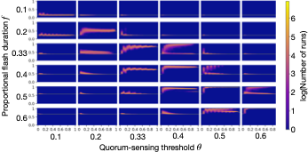
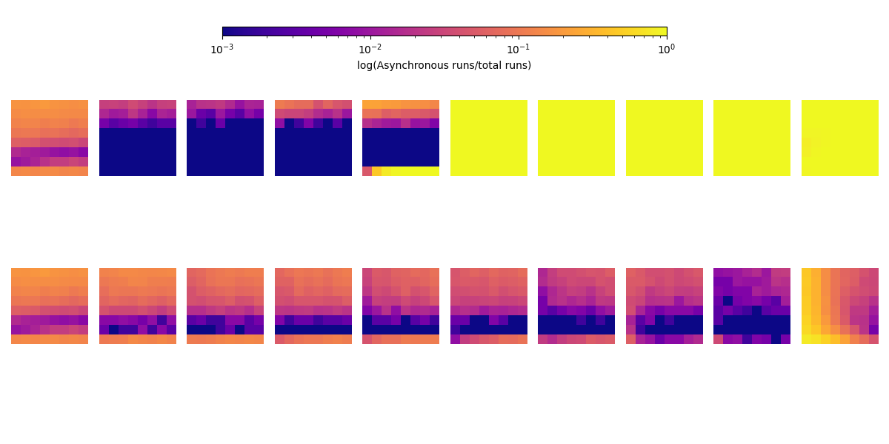
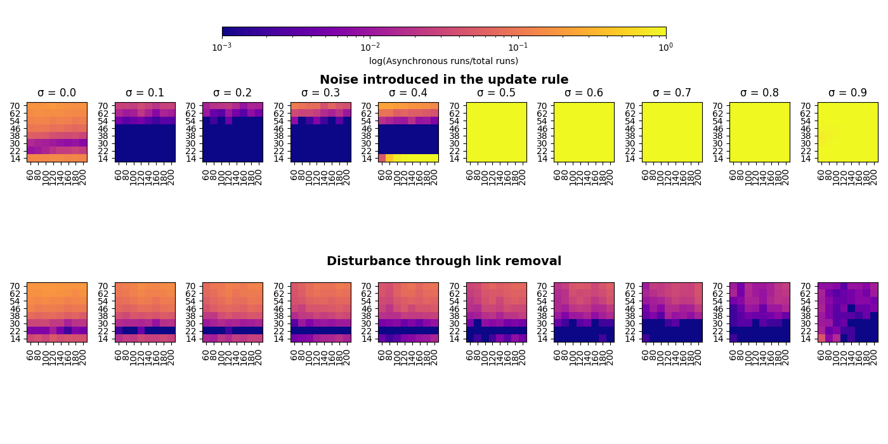
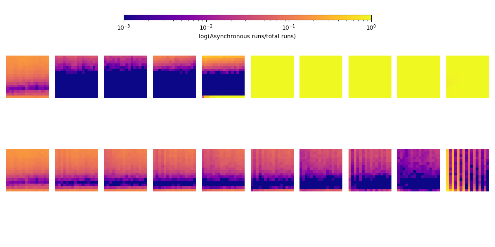

# Bimodal Performance in Time Synchronization in Distributed Agents

This repository accompanies the publication:

**“Bimodal Performance in Time Synchronization in Distributed Agents”**  

submitted to *The 18th International Conference on the Simulation of Adaptive Behavior (SAB 2026)*.

---
## Abstract

Pulse-coupled oscillator models inspired by firefly synchronization are widely used to study decentralized time coordination in distributed systems.
We analyze a discrete-time, discrete-phase firefly-inspired synchronization model and show that increasing connectivity does not always improve synchronization. Instead, the system exhibits two distinct performance regimes: either near-perfect synchronization or stable multi-cluster states.
We identify the underlying mechanism as symmetry-induced subgroup locking: at high connectivity, subgroups equally spaced in phase space reinforce their relative phase offsets, preventing convergence to a single synchronized state.
High synchronization is achieved only near a critical balance between the quorum threshold (the fraction of neighbors required to trigger a phase update) and the flashing duration.
We further show that either removing communication links or injecting noise eliminates the low-performance regime. Together with recent findings on spatial congestion in multi-robot systems, our results suggest a domain-general property of distributed systems: bimodal performance emerges when increasing agent density induces structural obstructions to coordination, whether physical (spatial crowding) or dynamical (symmetry-induced phase locking).

---
## Code Overview

- `src/simulation.py`
  Core implementation of the firefly synchronization model.

- `src/generate_k_graph.py`
  Precomputes $k$-regular communication graphs.

- `src/*_experiments.py`
  Experimental wrappers around `simulation.py` for running simulations.

- `src/*.sh`
  Shell scripts to execute full experiment pipelines.

- `plotting_scripts/`
  Scripts for generating figures and visualizing results.

---

## Varying quorum sensing rule and flash duration using communication range $r$ connectivity
<p align="center">

</p>

**Fig. SF1:** Analysis of quorum-sensing threshold $\theta$ and flashing duration $f$.  
We find bimodal synchronization effects near the diagonal $\theta \approx f$. 
The axes of the subplots are max. amplitude normalized by swarm size [$F/N$] (vertical) and connectivity [$k/N$] (horizontal).


## Effect of Small Connectivity ($k$) on Synchronization Behavior

We observe an unusual behavior when choosing small connectivity values $k$.
This effect is particularly visible in the link removal experiments at $\sigma = 0.9$.

<figure>
  
</figure>
<p align="center">
  (a) odd <i>k</i>
</p>
<figure>
  
</figure>
<p align="center">
  (b) even <i>k</i>
</p>
<figure>
  
</figure>
<p align="center">
  (c) all <i>k</i>
</p>

**Fig. SF2:** Comparison of synchronization behavior for odd, even, and all connectivity regimes $k$.

In these experiments, we progressively remove links such that:
- $N = 50 \rightarrow k = 5$
- $N = 60 \rightarrow k = 6$
- $\dots$
- $N = 200 \rightarrow k = 20$

This results in extremely sparse connectivity, leading to an edge-case regime where synchronization behavior becomes highly sensitive to the network structure.

---

### Probabilistic Interpretation of Neighbor States

We hypothesize that the observed behavior is related to the underlying distribution of possible neighbor configurations.
Specifically, we consider:

$P(\text{Neighbors flashing} > k/2)$

This measures the probability that more than half of a node’s neighbors are in the flashing state (i.e., the majority condition), independent of the actual dynamics.

### Key observation

- For **odd $k$**, this probability is effectively balanced around 50%.
  - Example: $k = 5$
    Possible partitions:
    - $\{0,1,2\}$ vs. $\{3,4,5\}$
  - The state space can be split symmetrically.
- For **even $k$**, the partition is asymmetric:
  - Example: $k = 6$
    - $\{0,1,2,3\}$ vs. $\{4,5,6\}$
  - The middle state introduces a slight imbalance.
Although this effect diminishes for larger $k$, the asymmetry remains measurable. For example:

```
k = 198: P(Neighbors flashing > k/2) = 0.47168 | threshold = 100
```

One possible interpretation is that when $P \approx 50\%$, the initialization behaves similarly to a coin-flip regime, which may lead to symmetric configurations that are harder for the system to escape, especially when only very few connections are established. In contrast, when $P < 50\%$, this symmetry is weakly broken, potentially facilitating synchronization. However, this remains a speculative explanation based on empirical observations rather than a derived mechanism.

